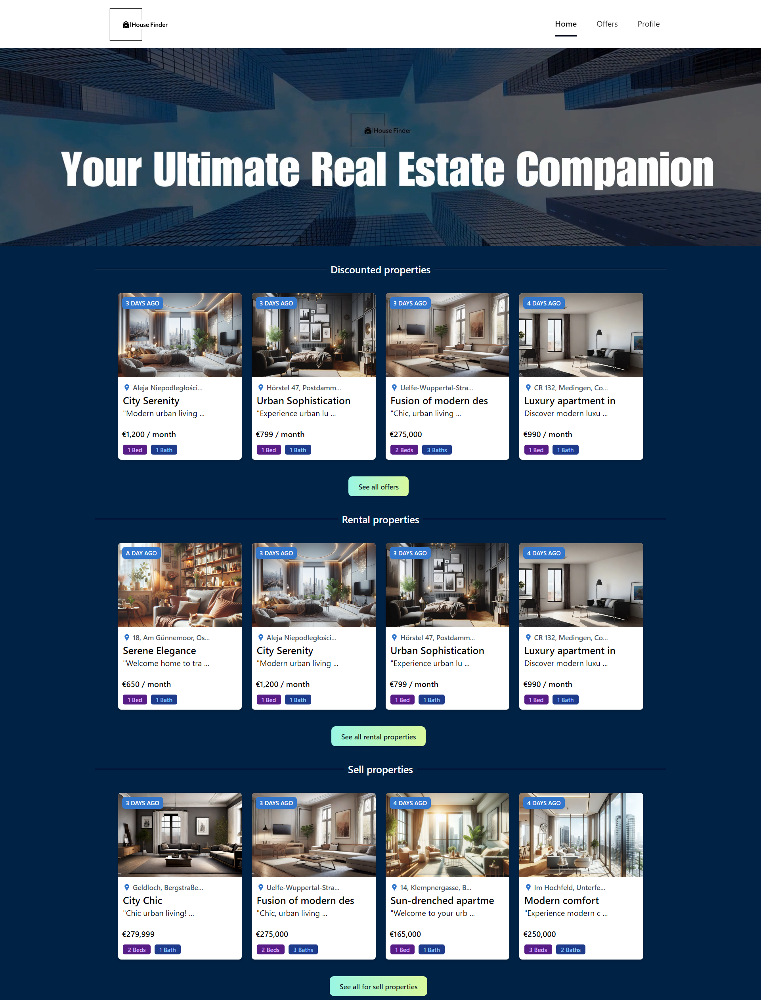
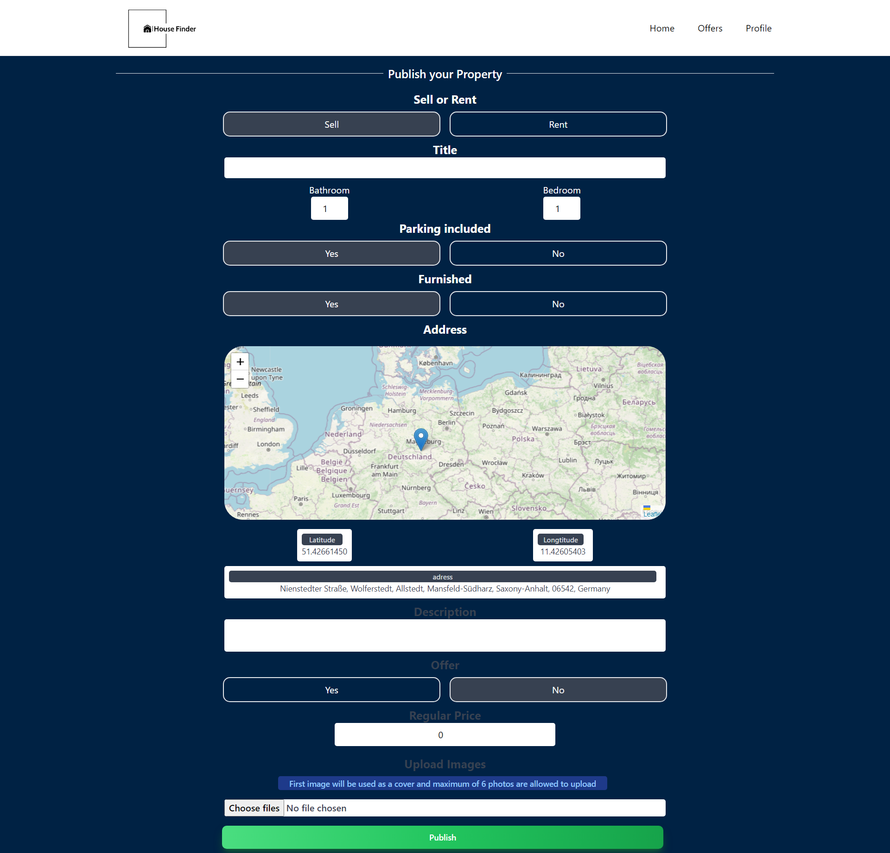
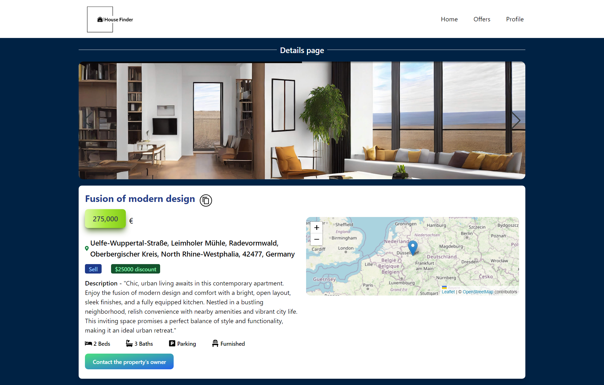

**_Live demo : https://house-finder-pi.vercel.app/_**

# House finder

House Finder is a cloud-based application that enables individuals to publish their properties for sale or rent. To advertise your property, follow these simple steps:

- Sign in via your Gmail account or email.
- Navigate to the "Profile" section and select "Publish my offer."
- Complete the form with your property's details, and use the map interface to specify the address of your house. Simply drag and drop the marker on the map to your desired location, and the address will be automatically generated.

That's it! Your advertisement is now created, and users of the website can visit your property and send you a message via the dedicated interface on the website to get more information.

# Technical objectives

House Finder is a full-stack advertising platform that utilizes Google Cloud's backend-as-a-service Firebase for authentication and primary database. For the front-end, it uses ReactJS as the frontend library and Tailwind CSS as the styling framework.

The use of Firebase in this project has significantly sped up the development process, as it provides a complete and secure authentication system and a fast and reliable database. Additionally, since the project is backed up by Google's servers, it guarantees reliability, scalability, and fast data transfer that can serve customers from the nearest data center. This showcases the power of cloud services, particularly in the case of Firebase.

ReactJS and Tailwind CSS combined make it possible to have an attractive design, implemented using a component-based architecture. One significant advantage of using ReactJS is the availability of external libraries built specifically for this library, such as React-Leaflet, React-Error-Boundary, React-Toast, React-Icons, and more.
 

  
  
  

